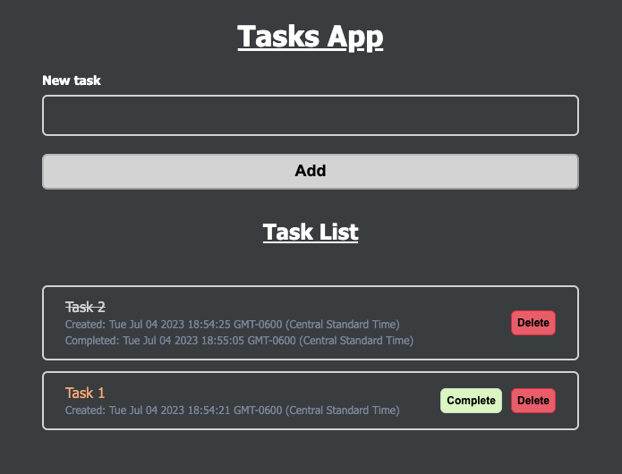

# Vuejs Technical Test

This small project was made using [Nuxt 3](https://nuxt.com/docs/getting-started/introduction).

The site https://crudapi.co.uk was used to get the extra points. Due to this fact, a `.env` file is used to set the API key needed to call the API. The reason behind this is to avoid uploading my API key to the GitHub repository and to demonstrate best practices when handling secrets and API keys.

## Setup

Make sure to install the dependencies:

```bash
# npm
npm install
```

## Set API KEY

Generate an API key at https://crudapi.co.uk. Copy and paste the generated key on the environment variable `CRUDAPI_KEY` and replace the text that is currently assign to it instead, which is `"YOUR https://crudapi.co.uk API KEY GOES HERE"`. If an API key is not set, the calls to the crud API will not work. 


## Development Server

Start the development server on `http://localhost:3000`:

```bash
# npm
npm run dev
```


## Code Walkthrough

Three main functions were needed to handle the creation, modification (completion) and deletion of tasks. The API calls were done with the help of the `useFetch` hook, and using the `onResponse()` interceptor to do a pessimistic update on the UI, this eliminates the need of refresing the page to show the updates on the UI. The routes on each API call are defined on the `server/api` directory, following Nuxt's services naming convention, and also a good mnemonic pattern was used when naming all variables, functions and CSS classes for ease of understanding.

```
async function addTask() {
  isAdding.value = true
  await useFetch('/api/task', { method: "post", body: [{
    "title": newTask.value,
    "completed": false
  }],
  async onResponse() {
    await refreshNuxtData("tasks")
    newTask.value = ""
    isAdding.value = false
  }})
}

async function completeTask(todo) {
  isCompleting.value = true
  isCompletingUuid.value = todo._uuid
  await useFetch('/api/task', { method: "put", body: [{
    "_uuid": todo._uuid,
    "completed": true
  }],
  async onResponse() {
    isCompleting.value = false
    isCompletingUuid.value = ""
    await refreshNuxtData("tasks")
  }})
}

async function deleteTask(uuid) {
  isDeleting.value = true
  isDeletingUuid.value = uuid
  await useFetch('/api/task', { method: "delete", body: { uuid },
  async onResponse() {
    isDeleting.value = false
    isDeletingUuid.value = ""
    await refreshNuxtData("tasks")
  }})
}
```

Additionally, `SASS` was used to define some styles, such as different colors to tell apart the Complete and Delete action buttons, disabling the Add button when the input is empty and changing its color accordingly, and set different text colors and sizes depending on its data type.

## Web app screenshot

